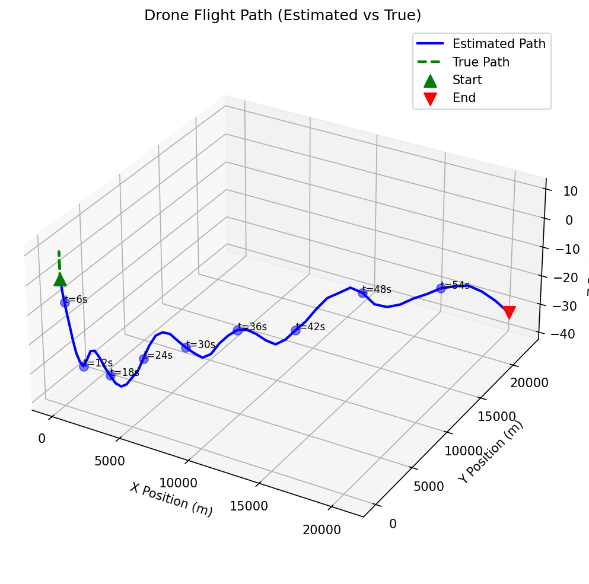
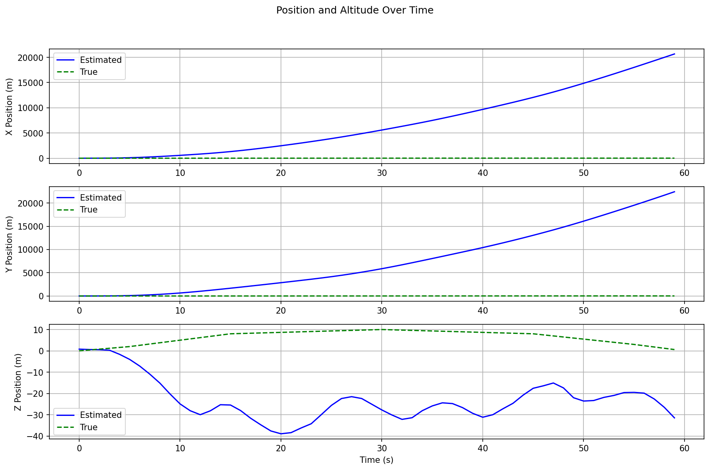
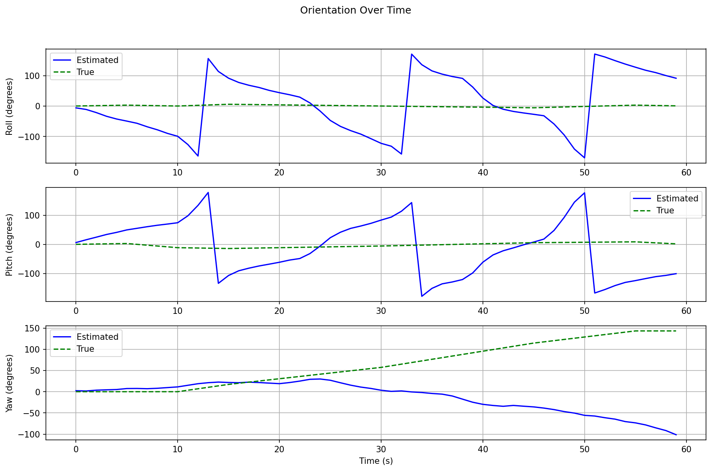
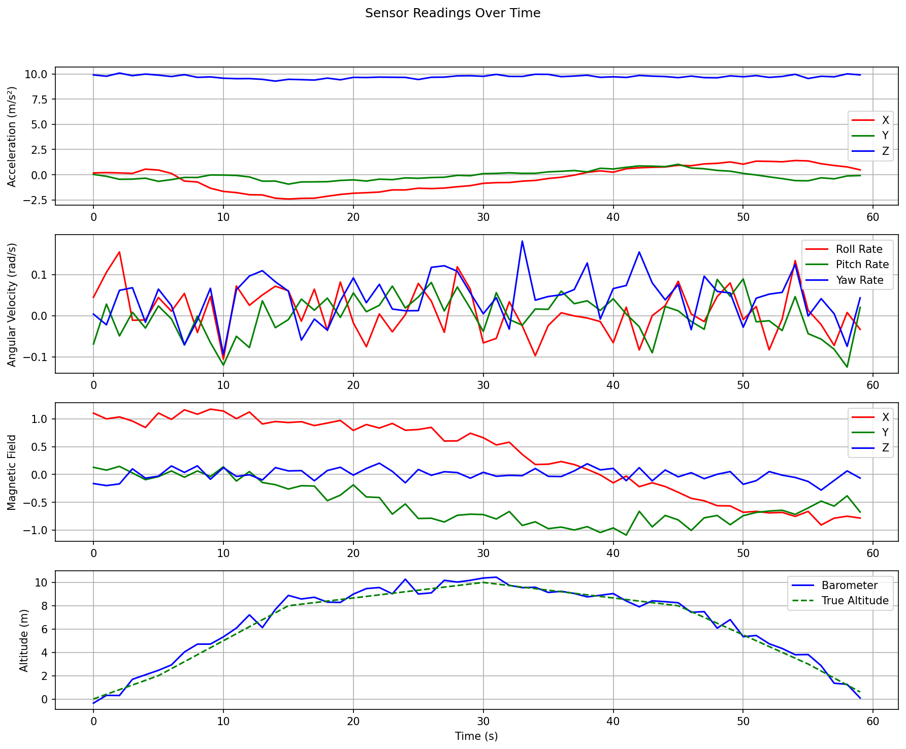
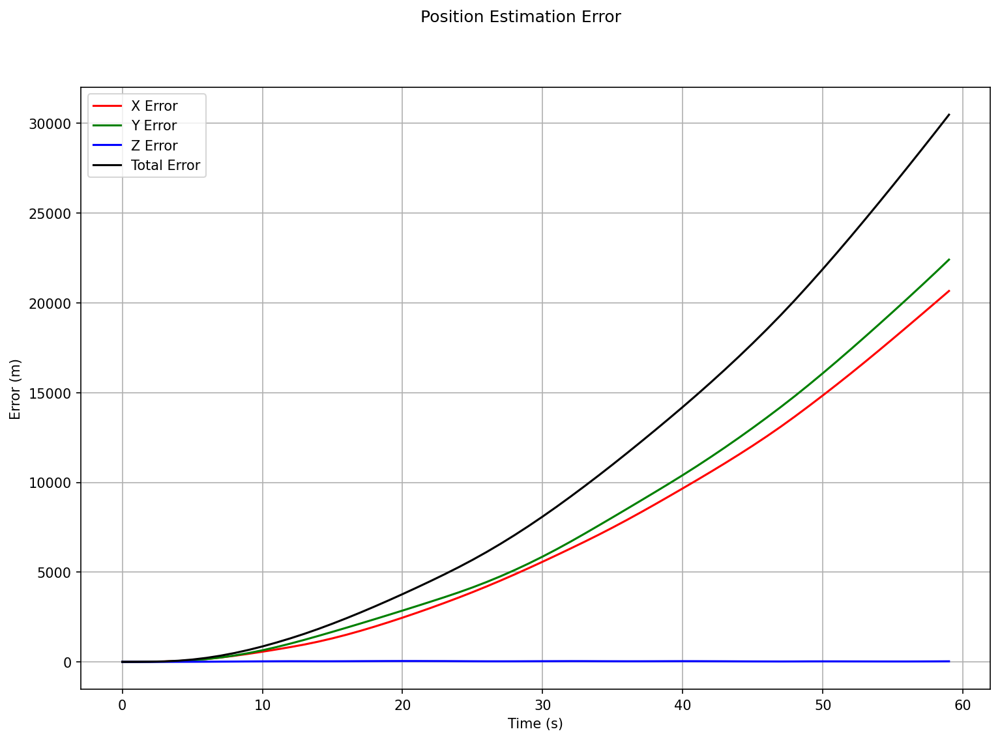
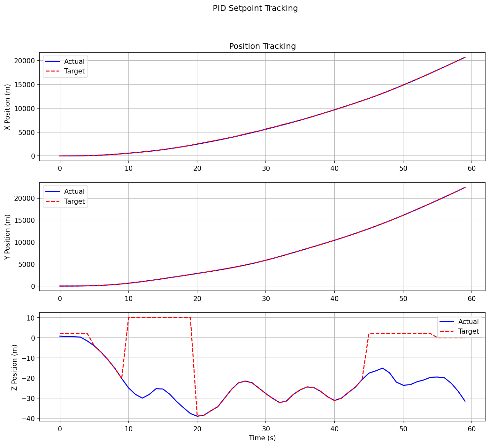
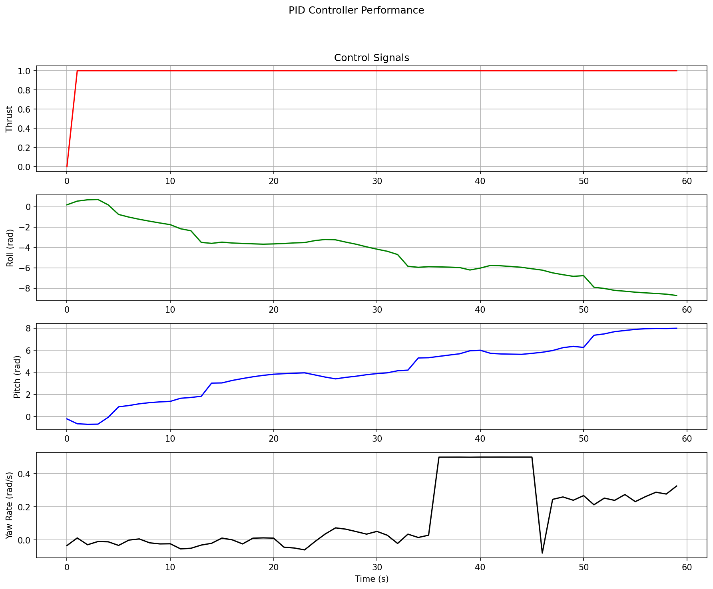

# 🛰️ AI Drone Auto-Navigation System — Web Interface

This static site showcases the flight simulation results of an autonomous drone system that operates **without GPS**. It includes real-time sensor fusion, Kalman filtering, FSM-based behavior, PID control, and wind compensation.

Visualized with beautiful plots — all generated from simulation runs!

---

## 📸 Drone Flight Visualizations

Below are plots representing various aspects of the drone’s performance — position, velocity, orientation, error trends, control signals, and more.

  
  
  
  
   
  
  
  
   
  

---

## 💡 Key Simulation Features

- ✅ **Sensor Fusion** with realistic IMU, magnetometer, and barometer data  
- ✅ **Kalman Filter** for smoothing and predicting state transitions  
- ✅ **Finite State Machine (FSM)** for behavior logic  
- ✅ **PID Controllers** for altitude, position, and orientation control  
- ✅ **Wind Scenarios** to test drone stability under different environmental disturbances  
- ✅ **Matplotlib**-based flight visualization

---

## 🌐 About This Web Version

This version is meant to serve as a **read-only, static showcase**. It allows users to view:

- 7 simulation result plots
- Grid-based responsive image layout
- Insight into how the drone stabilizes and adapts

---

## 

📁 Directory Structure
📁 plots/ 

# Contains all drone_plot_*.png images 

📄 index.html 

# Main entry point (static page with plot previews) 

📄 README.md 

# You're reading it

---

## 🚀 How to Deploy as Static Site

You can deploy this on:

- **Replit** (as a static HTML project)
- **GitHub Pages**
- **Vercel / Netlify**
- **Firebase Hosting**
- **Any simple file host**

Just make sure your file structure is preserved, especially the `/plots` folder.

---

## 🔗 Connect

Made with ❤️ by [Aung Ye Zaw](https://www.linkedin.com/in/aungyezawdev)

GitHub: [@AungYeZawDev](https://github.com/AungYeZawDev)  

Project Page: [AI-Drone-Auto-Navigation-System-Web-Interface](https://drone.thanlar.com)
Project Repo: [AI-Drone-Auto-Navigation-System](git@github.com:AungYeZawDev/AI-Drone-Auto-Navigation-System.git)

---

